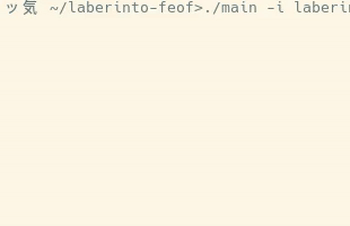

# laberinto-feof
   
Un programa sin interfaz (feo).  
## Compilación  
En unix, usar Makefile. 
## Ejecutar 
En modo recursivo (mov random):  
```bash 
./main -r laberinto.txt  
```  
En modo iterativo (mov patron):  
```bash
./main -i laberinto.txt   
```  

